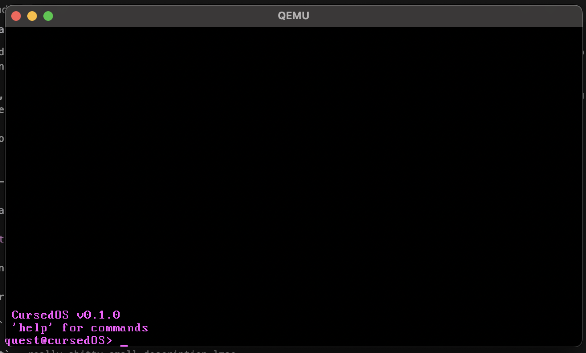

# CursedOS

Version - 0.0.1

Following in the footsteps of our lord and saviour, Terry A. Davis... in Rust.


<!--## What makes it cursed?
There's a few things we implemented to make it cursed. Not in a stupid band kid "haha that's so cursed!!" way, in like an actually malicious and evil sense.
First of all the error messages tell you basically nothing. Have fun there, buddy.

Second of all, the kernel is designed to (pseudo)randomly overwrite memory as it sees fit. Better have a plan in mind for when random spots of memory get overwritten with 0xBOOOOOOOO!!

Third, the graphics engine will randomly put eyes in places there should not be eyes. You're already being watched everywhere you go, might as well have eyes on you in your home OS, too.

I'm not telling you the rest. You'll have to figure them out for yourself. -->


## What you can do so far:

`create` - you can create a user 
<br>
`login` - you can log into the user account you made!
<br>
`clear` - obviously clears the screen lol
<br>
`help` - lists all the commands lol
<br>
`about` - really shitty small description lmao
<br>
`logout` - log out of your user account
<br>
`exit` - closes qemu
<br>
`whoami` - shows you who the user is

## How to Run it on your computer

lmao probably don't try to install it on baremetal or you might kill your computer.
1.  Download the bootimage from the releases page

2. Install Qemu:
<br>
    >macOS (Homebrew): `brew install qemu`<br>
Ubuntu/Debian: `sudo apt-get install qemu-system-x86`<br>
I lowkey do not know how to run this on Windows :heavysob:

3. Run:

```
qemu-system-x86_64 -drive format=raw,file=[user]/[path]/bootimage-cursed_os.bin -serial stdio -no-reboot -no-shutdown
```

You should get something like the image




<br>
"Lou why isn't this in main?" I am working in this with someone else so having stuff on my branch helps keep everything organised and not invasive of what they might be working on :)

<br>
<br>
"Lou why are the commits not regular" I initially wasn't intending on having this as an Athena project lmao but here we are. Also a heads up, I started working on this on my computer from about 1st September so that's where the time comes from.
<br>

<br>
also fun fact when i was working on this at my friend's house we built it on nano running on a mac with arch linux (this was...interesting):3
